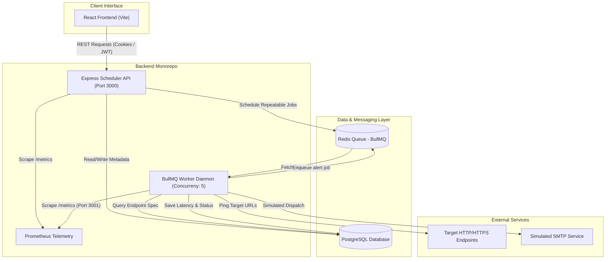
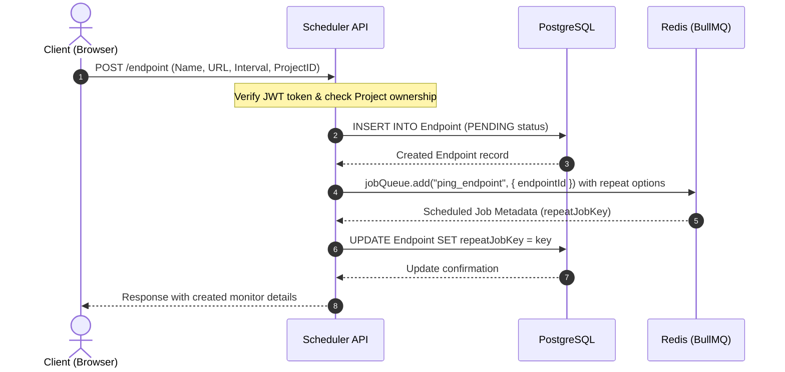
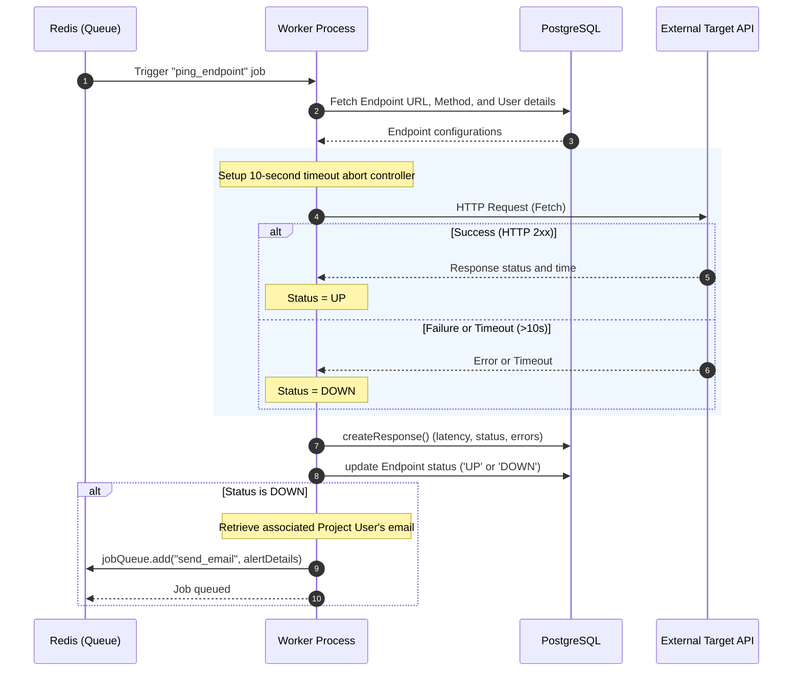
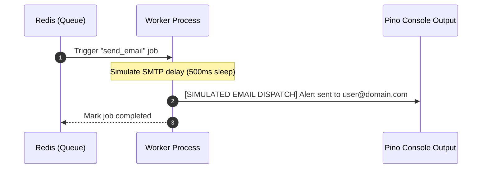
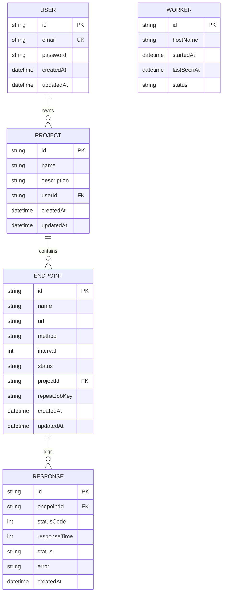

# System Architecture

This document describes the high-level architecture, component communication flows, and data relationships of the API Monitor system.

---

## 1. System Component Overview

The system uses a decoupled, event-driven architecture to ensure web servers are not blocked by synchronous HTTP check calls. Uptime monitoring checks are offloaded to asynchronous worker processes using a message queue.

---

## 2. Dynamic Workflows

### Scheduling a Health Check
When a user adds a new endpoint monitor from the dashboard, the following sequence occurs:

### Health Check Execution Loop
Workers process scheduled jobs concurrently. Below is the operational lifecycle of a single check:

### Alert Dispatch Workflow
If an endpoint transitions to a `DOWN` status, it spawns a separate notification task:

---

## 3. Data Relationships (ERD)

The database schema models user organization, monitored workspaces, status histories, and background task statuses.

*Note: The `Worker` entity exists independently to log operational processes and metadata, checking the runtime health of daemon instances.*

---

## 4. Telemetry and System Monitoring

The system uses Prometheus to expose application performance metrics, defined inside the shared backend module (`packages/shared`):

1. **HTTP Requests Metrics**: Tracks Express HTTP requests throughput, route-matching latencies, and response codes.
2. **`jobs_processed_total`**: A counter tracking total processed jobs labeled by type (`ping_endpoint` or `send_email`) and outcome status (`completed` or `failed`).
3. **`job_execution_duration_seconds`**: A histogram tracking the execution runtime of background worker jobs to detect Redis or API connection bottlenecks.
